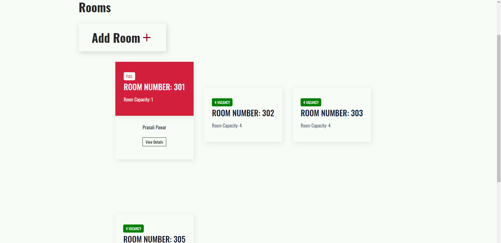

# Hostel Management System

## Project Description

### This project aims to build a website which makes it easier to for admin to manage the hostelites and for the hostelites to manage their profiles along with access to notices, mess timetable, hostel rules, adding reviews and other relevant information

## Features

* ## Admin Roles
    ### 1. Post and delete Notices
    ### 2. Assign Rooms to new hostelites
    ### 3. Post and remove Lost and Found
    ### 4. Remove Hostelites
    ### 5. Add, manage and delete rooms
    ### 6. Post and view Images in gallery
    ### 7. Upload Mess Timetable
    ### 8. Upload Hostel Rules

* ## User Roles
    ### 1. Registration and Login
    ### 2. View Notices
    ### 3. Add and delete Reviews
    ### 4. Add guardian details, address details, personal  details
    ### 5. View Alloted Room details
    ### 6. Post and remove Lost and Found
    ### 7. View Gallery
    ### 8. View Mess Timetable
    ### 9. View Hostel rules
# Project Images
## Landing Page 

## Landing Page

## Landing Page

## Landing Page

## User Login

## User Home Page

## Notice

## Reviews

## Add Review

## Admin Home Page

## Rooms Page

## Completely occupied room

## Room with vacancy

## Room Details

## Assigning rooms to hostelite

## Add new room

     
